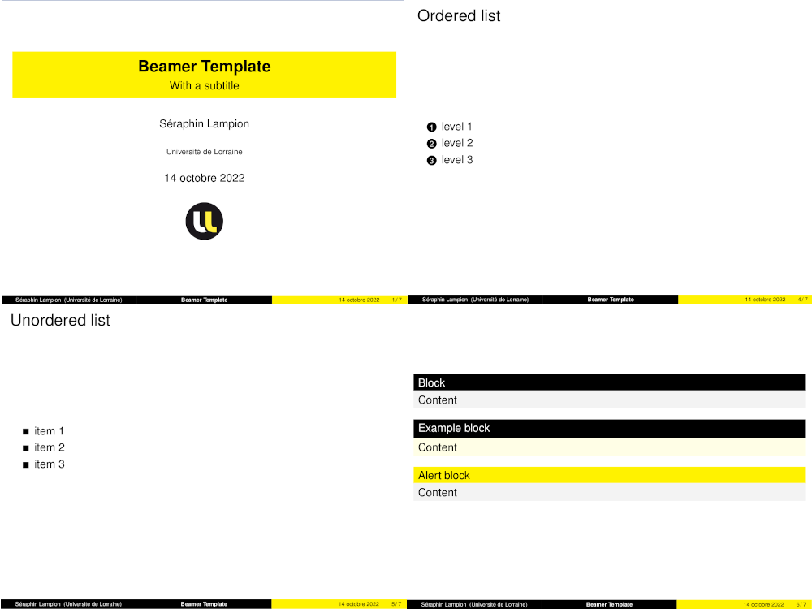

# Beamer theme for Université de Lorraine

Theme adapted from Joseph Vidal-Rousset template (available on Overleaf), which was adapted from Amine Najahi's template.

## Compilation

Example can be compiled by running:

```
make && make clean
```

:warning: This is compatible with `pdflatex`, not tested with other tools.

## Screenshot



## Licence

Published under GPL 3.0.
